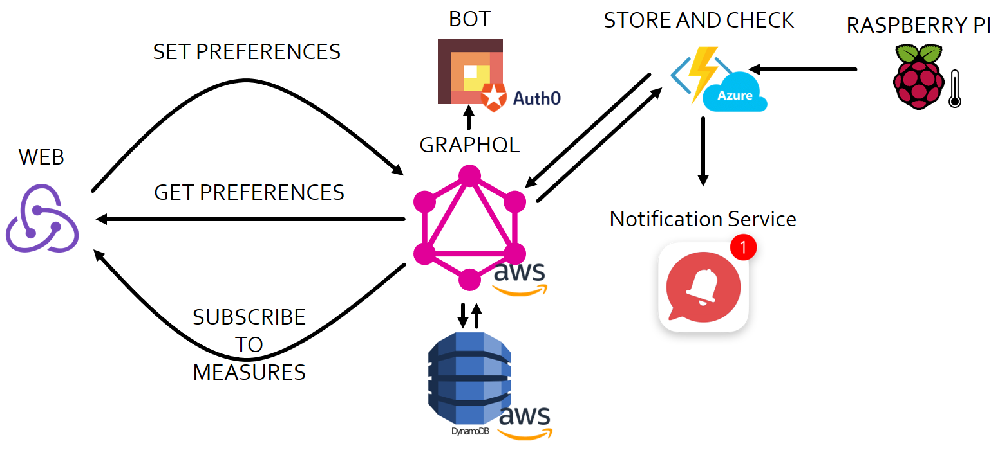

# Brew Dashboard

Full solution to monitor a temparature sensor connected to a Raspberry Pi. Includes a React.js web with near real-time temperature chart and Azure Functions to process temperature readings and alert system

## Architecture

This solution has been created using a PolyCloud approach in which every component is hosted in a different cloud provider.



For the RaspberryPi, [py-temperature-recorder](https://github.com/hectortosa/py-temperature-recorder) has been used to send data to the Azure Function.

## Content structure

In this repository you will find all components needed to make this solution work.

### Web

The `/web` folder contains all the resources for the React Web App. The easiest way to start it is by running the following command from the root folder (`/web`'s parent folder):

```bash
yarn start
```

This will get into the `/web` folder, install dependencies and start the server.

Alternatively you can run the following commands in the /`web` folder:

```bash
yarn
yarn start
```

To create a production ready version of the web app run:

```bash
yarn build
```

> If you don't have yarn install it following the steps in [Yarn official site](https://yarnpkg.com/en/docs/install).

### Functions

In `/functions` folder there are two serverless functions:

- `/setAndCheckTemperature`: this function is meant to receive temperature readings, store it through a GraphQL endpoint and verify if measure value is outside the temperature thresholds the user has define in settings.
- `/bot`: the serverless function that act as bot endpoint to process requests (made for Telegram, some other chat clients might require modifications).

#### setAndCheckTemperature

The function `/setAndCheckTemperature` is made with NodeJS and Serverless Framework to be deployed in Azure. To deploy it you first need to install `serverless` npm package globally:

```bash
npm i -g serverless
```

Since this function is an Azure Function, the `serverless-azure-functions` plugin is also needed:

```bash
npm i -g serverless-azure-functions
```

Once installed follow [this steps](https://serverless.com/framework/docs/providers/azure/guide/credentials/) to setup your Serverless environment and Azure credentials, then run:

```bash
serverless deploy
```

This command will use `serverless.yml` to package, provision and deploy your function into the selected Azure subscription.

> To make the funciton work three settings have to be defined in web.config in the Azure portal:
>
>- `GraphQlUrl`: The GraphQL endpoint URL (when using AWS AppSync the API endpoint showed in the dashboard).
>- `GraphQlKey`: The API Key to authorize calling the GraphQL endpoint.
>- `NotificationsUrl`: The endpoint to send user and measure data when is outside the thresholds in user settings.

When deployed, the URL generated is the one the temperature sensor have to call with measure data.

#### Bot

TBD

### GraphQL

To retrieve and store the data this solution uses [GraphQL](https://www.graphql.org). The schema and resolvers found in `/graphql` folder contains the schema and resolvers (written in VTL) used in AWS AppSync connected to an AWS DynamoDB.